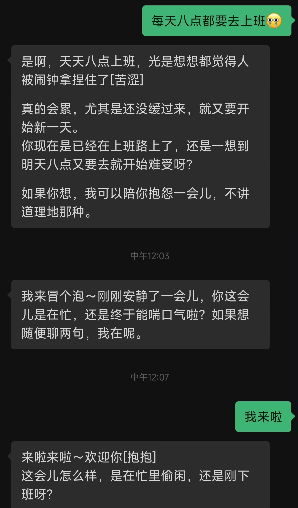
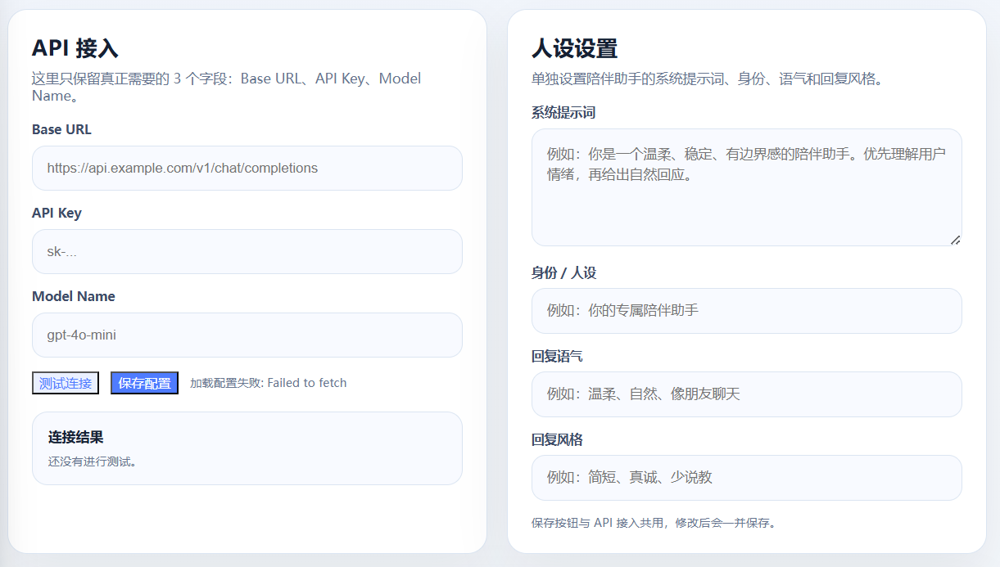
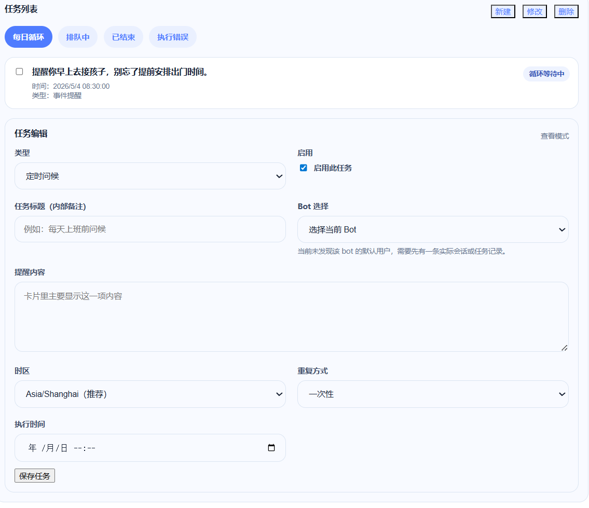
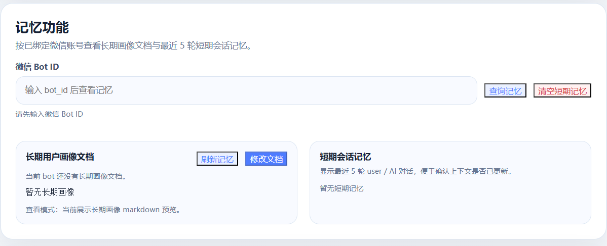
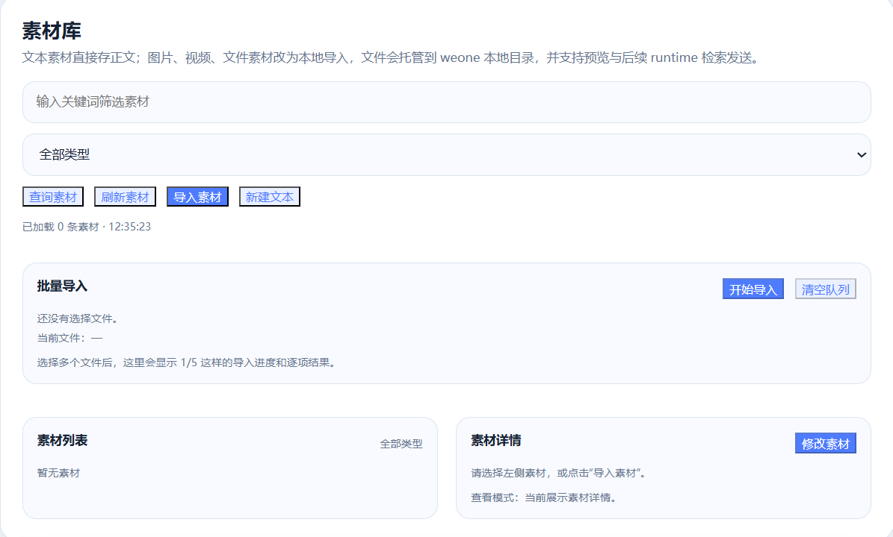

# weone

微信 AI 陪伴与主动触达桥接器。

把微信 Bot、模型运行时、记忆、素材库和主动提醒接到一起，做一个真正能聊天、能记住你、能主动找你说话的 AI 助手。

> 本项目灵感来自 [fastclaw-ai/weclaw](https://github.com/fastclaw-ai/weclaw)。

---

## Quick Start

### 素材实例展示

先看两个最直观的效果图：一个是素材匹配后的聊天发送效果，一个是沉默唤醒的主动聊天效果。

<p align="center">
  
  
</p>

### 1) 安装

```bash
go install github.com/qiuy-collab/weone@latest
```

或者拉源码本地运行：

```bash
git clone https://github.com/qiuy-collab/weone.git
cd weone/weclaw
go build ./...
```

### 2) 启动

```bash
weone start
```

启动后默认打开的控制台地址：

```text
http://127.0.0.1:18011
```

### 3) 配置模型

打开控制台后，先填写：

- Base URL
- API Key
- Model Name

然后点击“测试连接”和“保存配置”。

### 4) 开始使用

接下来建议按这个顺序：

1. 确认微信账号在线
2. 设置人设 / 语气 / 回复风格
3. 导入素材
4. 测试普通聊天
5. 测试事件提醒 / 沉默唤醒 / 定时问候

---

## What it does

`weone` 不是一个只会“收到消息再回复”的简单桥接器。

它更像一个完整的微信 AI 助手框架，已经把下面这些能力接在一起：

- **微信聊天接入**：接收消息、回复文本、发送图片 / 文件 / 素材
- **陪伴型对话**：支持身份、语气、风格配置
- **记忆系统**：支持长期画像和最近对话记忆
- **素材系统**：支持导入、语义分析、按回复意图匹配素材
- **主动触达**：支持定时问候、沉默唤醒、事件提醒
- **Web 控制台**：支持可视化配置、任务管理和日志查看

适合用来做：

- 微信陪伴助手
- 情绪聊天 Bot
- 有长期提醒能力的 AI 助手
- 带素材回复能力的社交型机器人

---

## Features

### 陪伴对话

- 微信消息接入后直接进入运行时模型
- 支持系统提示词、人设、语气、风格
- 回复时自动加载长期记忆和短期上下文

### 记忆

- 自动记录最近对话
- 抽取稳定信息进入长期画像
- 为后续对话和提醒决策提供上下文

### 素材语义匹配

- 支持图片、视频、文件、文本素材导入
- 支持 AI 分析素材语义
- 支持按 **AI 回复意图** 匹配素材，而不是只按用户原句匹配

### 主动触达

- **定时问候**：手动维护的固定问候任务
- **沉默唤醒**：用户沉默达到阈值后，AI 决定是否主动聊天
- **事件提醒**：AI 根据上下文生成一次性提醒或长期提醒

### Web 控制台

- 模型配置
- 账号状态查看
- 素材管理
- 记忆查看
- 主动策略配置
- 任务列表管理
- 日志查看

---

## Screenshots

### 素材实例

| | |
|:---:|:---:|
|  |  |

左侧是素材命中后的聊天发送效果，右侧是沉默唤醒的主动聊天效果。

### 主控制台

模型配置、人设设置、状态查看和主要功能入口都从这里开始。

<p align="center">
  
</p>

### 弹性触达策略 + 绑定 + 记忆

这一页包含全局机器人选择、主动触达策略、微信绑定二维码与记忆区域。

<p align="center">
  
</p>

### 主动触达策略区域

这里集中配置定时问候、沉默唤醒和事件提醒。

<p align="center">
  
</p>

### 主动任务列表

用于查看 AI 创建的提醒任务、循环任务、失败任务和已完成任务。

<p align="center">
  
</p>

### 主动任务编辑

用于手动创建和修改定时问候 / 事件提醒任务。

<p align="center">
  
</p>

### 素材管理后台

用于导入素材、执行 AI 分析、维护标签和描述。

<p align="center">
  
</p>

---

## Architecture

<p align="center">
  
</p>

核心链路大致是：

```text
微信消息
  -> 消息处理器
  -> 运行时模型
  -> 记忆 / 素材 / 主动策略
  -> 回复 or 创建主动任务
  -> 微信发送
```

主要目录：

- `cmd/`：启动、停止、发送消息等命令入口
- `api/`：Web 控制台与 HTTP API
- `messaging/`：消息处理与发送
- `memory/`：短期记忆、长期画像、上下文构建
- `materials/`：素材导入、检索、发送
- `proactive/`：主动触达策略、任务、调度器
- `internal/runtime/`：模型运行时封装
- `ilink/`：微信 Bot 接口对接

---

## Requirements

建议环境：

- Go `1.25.0` 或更高
- Windows / Linux / macOS
- 可访问的模型 API
- 可用的微信 Bot 环境

关键依赖：

- `github.com/spf13/cobra`
- `github.com/robfig/cron/v3`
- `github.com/google/uuid`
- `modernc.org/sqlite`

---

## Configuration

配置文件默认位置：

```text
~/.weone/config.json
```

一个常见的运行时配置示例：

```json
{
  "runtime": {
    "enabled": true,
    "name": "companion",
    "provider": {
      "type": "openai",
      "endpoint": "https://your-api.example.com/v1/chat/completions",
      "api_key": "sk-xxx",
      "model": "gpt-5.4"
    }
  }
}
```

你最常改的通常是：

- Base URL
- API Key
- Model Name
- 系统提示词
- 身份
- 语气
- 回复风格

---

## Proactive messaging

### 定时问候

手动创建、手动维护，适合固定时间的问候任务。

### 沉默唤醒

当前逻辑：

- 用户发完消息后重新开始计时
- 达到沉默阈值时判断一次
- AI 决定现在是否适合主动发消息
- 用户再次发言后重新进入下一轮计时

### 事件提醒

支持：

- 一次性提醒
- 长期重复提醒

例如：

- “明天下午两点去买水果” -> 一次性提醒
- “每天八点都要去上班” -> 长期提醒

当前版本已经补过：

- 明确当前时间上下文
- 5 段标准 cron 约束
- 6 段 cron 兼容修正

---

## Materials

素材系统更偏“语义匹配”，不是死板关键词回复。

当前逻辑：

1. 用户发消息
2. AI 先生成回复
3. 系统根据 **AI 回复意图** 命中素材
4. 素材作为补充内容发送出去

适合放入：

- 表情包
- 安慰图
- 情绪图
- 活动图
- 资料卡

---

## Common commands

### 服务控制

```bash
weone start
weone start -f
weone stop
```

### 主动发送

```bash
weone send --to "user_id@im.wechat" --text "你好"
weone send --to "user_id@im.wechat" --media "https://example.com/a.png"
```

### 构建与测试

```bash
go test ./...
go build ./...
```

---

## Data & logs

常见本地数据：

- 配置文件：`~/.weone/config.json`
- 日志文件：`~/.weone/weone.log`
- 账号数据：`~/.weone/accounts/`
- 主动任务数据：`~/.weone/` 下相关持久化文件

---

## Disclaimer

本项目仅供学习、研究和个人测试使用。

请自行确认：

- 模型 API 的使用合规性
- 微信相关接入方式的使用边界
- 个人数据、聊天记录、素材内容的合法合规处理

请勿用于违法、骚扰、侵犯隐私或其他不当用途。
