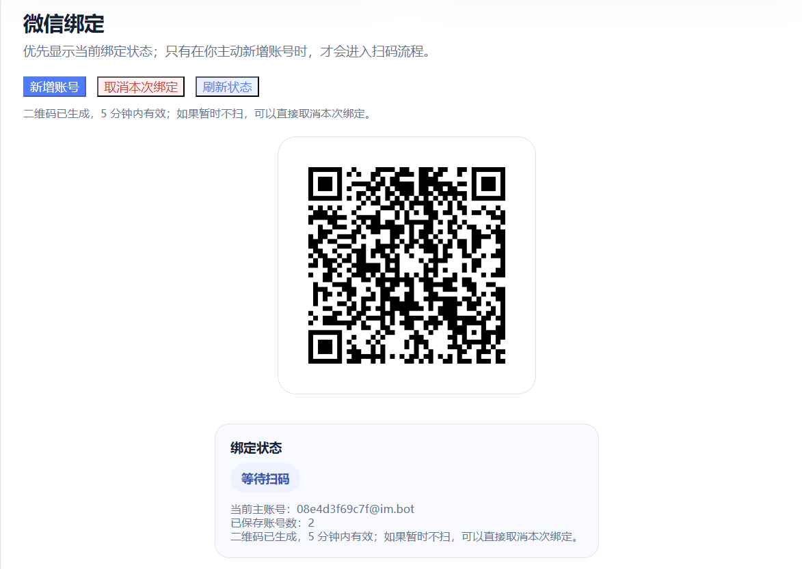
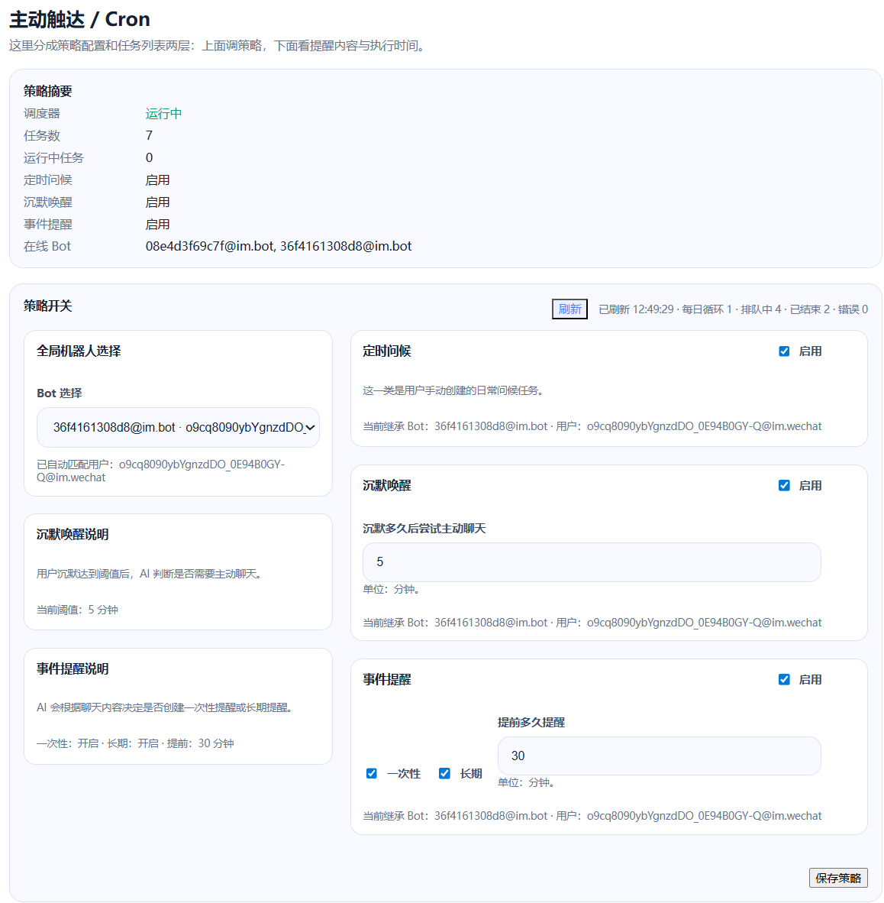

# weone

微信 AI 陪伴与主动触达桥接器。

把微信 Bot、模型运行时、记忆、素材库和主动提醒接到一起，做一个真正能聊天、能记住你、能主动找你说话的 AI 助手。

> 本项目灵感来自 [fastclaw-ai/weclaw](https://github.com/fastclaw-ai/weclaw)。

<p align="center">
  
  
</p>

---

## Quick Start

### 1) 安装

如果你已经配置过 Go 的 bin 到 PATH，可以直接：

```bash
go install github.com/qiuy-collab/weone@latest
weone start
```

如果是 Windows 首次使用，建议直接用这组完整命令：

```powershell
go install github.com/qiuy-collab/weone@latest
[Environment]::SetEnvironmentVariable("Path", $env:Path + ";$env:USERPROFILE\go\bin", "User")
$env:Path += ";$env:USERPROFILE\go\bin"
weone start
```

如果你更想本地编译运行：

```bash
git clone https://github.com/qiuy-collab/weone.git
cd weone
go build ./...
./weone start
```

### 2) 启动

如果你使用的是 `go install`：

```bash
weone start
```

如果你使用的是本地 `go build`：

```powershell
.\weone.exe start
```

启动后默认打开的控制台地址：

```text
http://127.0.0.1:18011
```

### 3) 配置模型

打开控制台后，先填写：

- Base URL
- API Key
- Model Name

然后点击“测试连接”和“保存配置”。

### 4) 开始使用

接下来建议按这个顺序：

1. 确认微信账号在线
2. 设置人设 / 语气 / 回复风格
3. 导入素材
4. 测试普通聊天
5. 测试事件提醒 / 沉默唤醒 / 定时问候

---

## Web 控制台

### 模型配置

模型 API、陪伴人设和基础运行参数都在这里配置。

<p align="center">
  
</p>

这里通常会配置：

- Base URL
- API Key
- Model Name
- 系统提示词
- 身份
- 语气
- 回复风格

### 微信绑定

微信绑定区负责新账号绑定、二维码状态查看和绑定状态确认。

<p align="center">
  
</p>

适合用来：

- 新增微信 Bot
- 查看二维码是否有效
- 确认当前主账号与绑定状态

### 记忆功能

记忆区可以查看长期画像文档和最近几轮短期会话记忆。

<p align="center">
  
</p>

当前这部分支持：

- 查看长期用户画像
- 查看最近短期记忆
- 编辑长期画像文档
- 清空短期记忆用于重新测试

### 素材管理

素材后台用于导入、分析、维护和预览素材。

<p align="center">
  
</p>

当前支持上传的素材类型包括：

- 文本素材
- 图片素材
- 视频素材
- 文件素材

素材链路不是简单关键词回复，而是：

1. 用户发消息
2. AI 先生成回复
3. 系统根据 **AI 回复意图** 命中素材
4. 素材作为补充内容发送出去

聊天里的实际效果可以参考页首那两张实例图里的左图。

### 主动 Cron

主动触达模块负责配置和管理真正的主动行为。

<p align="center">
  
</p>

当前 cron / 主动任务分成三类：

- **定时问候**：手动维护的固定问候任务
- **沉默唤醒**：用户沉默达到阈值后，AI 决定是否主动聊天
- **事件提醒**：AI 根据上下文生成一次性提醒或长期提醒

其中：

- 一次性提醒适合“明天下午两点去买水果”这类临时事项
- 长期提醒适合“每天八点都要去上班”这类规律事件
- 沉默唤醒会在达到阈值时判断一次，用户再次发言后重新计时

聊天里的实际效果可以参考页首那两张实例图里的右图。

---

## Architecture

<p align="center">
  
</p>

核心链路大致是：

```text
微信消息
  -> 消息处理器
  -> 运行时模型
  -> 记忆 / 素材 / 主动策略
  -> 回复 or 创建主动任务
  -> 微信发送
```

主要目录：

- `cmd/`：启动、停止、发送消息等命令入口
- `api/`：Web 控制台与 HTTP API
- `messaging/`：消息处理与发送
- `memory/`：短期记忆、长期画像、上下文构建
- `materials/`：素材导入、检索、发送
- `proactive/`：主动触达策略、任务、调度器
- `internal/runtime/`：模型运行时封装
- `ilink/`：微信 Bot 接口对接

---

## Configuration

配置文件默认位置：

```text
~/.weone/config.json
```

一个常见的运行时配置示例：

```json
{
  "runtime": {
    "enabled": true,
    "name": "companion",
    "provider": {
      "type": "openai",
      "endpoint": "https://your-api.example.com/v1/chat/completions",
      "api_key": "sk-xxx",
      "model": "gpt-5.4"
    }
  }
}
```

你最常改的通常是：

- Base URL
- API Key
- Model Name
- 系统提示词
- 身份
- 语气
- 回复风格

---

## Common commands

### 服务控制

```bash
weone start
weone start -f
weone stop
```

### 主动发送

```bash
weone send --to "user_id@im.wechat" --text "你好"
weone send --to "user_id@im.wechat" --media "https://example.com/a.png"
```

### 构建与测试

```bash
go test ./...
go build ./...
```

---

## Data & logs

常见本地数据：

- 配置文件：`~/.weone/config.json`
- 日志文件：`~/.weone/weone.log`
- 账号数据：`~/.weone/accounts/`
- 主动任务数据：`~/.weone/` 下相关持久化文件

---

## Disclaimer

本项目仅供学习、研究和个人测试使用。

请自行确认：

- 模型 API 的使用合规性
- 微信相关接入方式的使用边界
- 个人数据、聊天记录、素材内容的合法合规处理

请勿用于违法、骚扰、侵犯隐私或其他不当用途。
